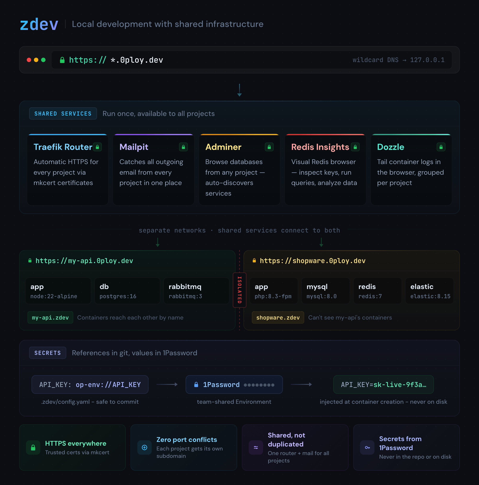

# zdev

**Ever seen a developer and an AI agent fall in love with a dev environment?** 🧑‍💻🤖❤️

zdev is a local development tool that gets you from `git clone` to coding in seconds. One command starts your entire project - HTTPS, routing, shared services, and secrets management. Simple enough for any AI coding agent to operate, powerful enough for complex multi-service setups.

```bash
cd my-project
zdev start
# Your project is running at https://my-project.0ploy.dev
```

> `0ploy.dev` is a wildcard DNS pointing to `127.0.0.1` - everything runs locally on your machine. No cloud, no accounts. You can use your own domain too.

**Requires:** a Docker engine. zdev talks to Docker through the `docker` CLI and the active docker context, so it works with [Docker Desktop](https://www.docker.com/products/docker-desktop/), [OrbStack](https://orbstack.dev/), or [Colima](https://colima.run/) on macOS, and Docker Engine on Linux. On macOS, **OrbStack** is the fastest option and **Colima** is a free, no-GUI alternative - see [ALTERNATIVE_BACKENDS.md](ALTERNATIVE_BACKENDS.md) for a benchmark and trade-offs.

## How It Works

Every project runs in its own isolated network. zdev gives each project its own HTTPS subdomain - no port conflicts, no SSL setup. Shared services like mail catching, database browsing, and Redis inspection are available to all projects automatically.

> [!IMPORTANT]
> ### Security
>
> **Your code runs in containers, not on your machine.** Every `pnpm install`, `composer install`, and dev server runs inside an isolated Docker container. If a malicious npm package tries to steal your SSH keys, read your browser cookies, or encrypt your files - it can't. It's trapped in a throwaway container with no access to your host. In an era where supply chain attacks on npm, PyPI, and Packagist are increasingly common, this isn't just convenience - it's protection.
>
> **Your secrets live in 1Password, not in `.env` files.** The config you commit holds only an Environment ID and `op-env://` references - real values stay in your team's shared [1Password Environment](https://www.1password.dev/environments) and are injected when containers are created. No `.env` handed around over Slack, no plaintext copies drifting on every laptop, nothing to leak when the repo, a backup, or an AI agent reads your config. See [Team Secrets from 1Password](#team-secrets-from-1password).



## Built for Coding Agents

zdev gives AI coding agents (Claude Code, Cursor, Copilot) exactly what they need: deterministic environments with zero ambiguity.

- **One command** - `zdev start` is all the agent needs. No multi-step setup to get wrong.
- **Predictable URLs** - The app is always at `https://{name}.0ploy.dev`. No port guessing.
- **Single config file** - `.zdev/config.yaml` is the complete source of truth. One file to read, not five.
- **Discoverable commands** - `ls .zdev/commands/` reveals all project-specific tasks. No guessing.
- **`zdev exec app <cmd>`** - Run anything in any container. No container name lookup needed.
- **No secrets in the loop** - config holds Environment IDs and `op-env://` references, not values. Agents read, edit, and commit the full config without ever handling secret material.

### Agent Integration

Install the zdev skill so your agent knows how to use the dev environment:

```bash
npx skills add 0ploy/zdev
```

This teaches your agent the full zdev CLI, config format, debugging workflows, and project setup patterns. Your agent can also help you create custom zdev [templates](#templates).

## Why zdev?

| Without zdev | With zdev |
|---------------|------------|
| Port conflicts between projects | Every project gets its own HTTPS subdomain |
| Each project configures its own mail, DB tools | Shared services run once, work for all projects |
| New developer spends a day setting up | Clone, `zdev start`, done |
| Complex Docker Compose with 100+ lines | Simple config with sensible defaults |
| Secrets passed around in `.env` files and Slack | Config references 1Password - commit it, clone it, `zdev start` |
| Slow file sync on macOS | Native-speed file sync, zero config |
| Malicious packages can access your entire machine | Code runs in isolated containers - supply chain attacks stay sandboxed |

## Quick Start

### 1. Install

```bash
curl -fsSL https://raw.githubusercontent.com/0ploy/zdev/main/install.sh | sh
```

The installer places the real binary at `~/.zdev/bin/zdev` and symlinks it into `/usr/local/bin` (one-time sudo prompt). After that, zdev checks GitHub at most once per 24 hours during command startup. When a new release exists it announces the update, downloads and verifies it synchronously, then installs it into the user-owned canonical path. The current command keeps running its in-memory version; the next invocation uses the new binary. Set `ZDEV_NO_UPDATE_CHECK=1` to disable. `zdev self-update` still works for on-demand updates and auto-migrates legacy installs to the symlink layout.

### 2. First-time setup

This installs SSL certificates and starts the shared services (router, mail catcher, DB browser):

```bash
zdev systemcheck
```

### 3. Create a project

The fastest way is to use a template:

```bash
zdev create express my-app
cd my-app
zdev setup
```

Open https://my-app.0ploy.dev - that's it. HTTPS works out of the box.

Or create a project manually with a config file at `my-app/.zdev/config.yaml`:

```yaml
name: my-app

services:
  app:
    image: node:22-alpine
    command: corepack enable && pnpm install && pnpm dev --host 0.0.0.0
    working_dir: /app
    volumes:
      - ${PROJECTPATH}:/app
    routing:
      port: 3000

mutagen:
  ignore:
    - node_modules
    - .pnpm-store
    - .nuxt
```

`${PROJECTPATH}` is resolved automatically to your project's absolute path. Other available variables: `${PROJECTNAME}`, `${PROJECTDIR}`, `${ZDEV_DOMAIN}`.

```bash
cd my-app
zdev start
```

## Templates

Create new projects from starter templates with `zdev create`:

```bash
zdev create express my-app            # Express.js
zdev create nuxt4 my-app              # Nuxt 4
zdev create symfony my-app            # Symfony
zdev create myorg/my-template my-app  # Any GitHub repo
```

Some templates scaffold the project during `zdev create` itself (via a `.zdev/scaffold.sh` hook) - for those, `cd my-app && zdev start` is all that's left. Others do their setup in a `zdev setup` step. Each template's README (and the next-steps `zdev create` prints) tells you which.

Browse all available templates on GitHub: [0ploy repositories matching `zdev-template-`](https://github.com/orgs/0ploy/repositories?q=zdev-template-). Each template's README explains what it includes and how to use it.

Want to create your own template? See the [Template Authoring Guide](templates/README.md).

## Shared Services

These run once and are shared across all your projects. No per-project configuration needed.

| Service | URL | What it does |
|---------|-----|--------------|
| Router | `https://router.shared.0ploy.dev` | Routing dashboard - see all routes |
| Mail | `https://mail.shared.0ploy.dev` | Catches all outgoing email ([Mailpit](https://github.com/axllent/mailpit)) |
| DB | `https://db.shared.0ploy.dev` | Browse any project's database ([Adminer](https://www.adminer.org/)) |
| Redis | `https://redis.shared.0ploy.dev` | Inspect Redis keys and data ([Redis Insights](https://redis.io/insight/)) |
| Logs | `https://logs.shared.0ploy.dev` | Tail container logs across all projects ([Dozzle](https://dozzle.dev/)), grouped per project |

**Connecting from your app containers:** Configure your app to send mail to `mail:1025` (SMTP, no auth). For databases and Redis, use your project's own service names (e.g., `db:5432`, `redis:6379`) - Adminer and Redis Insights are browser UIs, not the services themselves.

**Log retention:** Dozzle is a viewer, not a store. Logs come from Docker's per-container ring buffer (default in Docker Desktop: ~50 MB rotated, ~5 files), so they survive `zdev down` and Docker Desktop restarts but are **lost when a container is recreated** - that includes `zdev update` (on config drift), `zdev remove`, and `zdev services recreate`. To grow the per-container buffer, set `log-opts: { max-size, max-file }` in Docker Desktop's daemon JSON. Persistent log history across recreates needs a separate log shipper (Loki, Vector, etc.) and is out of scope for zdev.

**Per-project visibility:** Dozzle only shows containers from projects that opt in via `shared.logs: true`. Projects without it stay hidden, even though Dozzle has full Docker socket access. Shared service containers (router, mail, db, redis, logs) are always visible.

**In-container shell is off by default.** Dozzle can open a shell into any container it sees, but the router publishes ports on all interfaces, so on an untrusted network (shared office, coffee-shop Wi-Fi) that shell is reachable by anyone who can hit the host. Enable it only on a network you trust by setting `shared.logs.shell: true` in `~/.zdev/global-config.yaml` (changes take effect on the next `zdev services recreate` or `zdev start`).

Open them directly:

```bash
zdev mail        # open Mailpit
zdev db          # open Adminer
zdev redis       # open Redis Insights
zdev logs --open # open Dozzle log viewer
```

**Per-project opt-in/out.** `router`, `mail`, and `logs` are connected to every project by default; `db` and `redis` are opt-in. Override individual fields under `shared:` in `.zdev/config.yaml`; missing fields keep their defaults.

```yaml
# .zdev/config.yaml
shared:
  db: true       # opt in  (default: false)
  redis: true    # opt in  (default: false)
  mail: false    # opt out (default: true)
  # router, logs not listed -> stay at default true
```

## Features

### Automatic HTTPS

Every project and shared service gets locally-trusted HTTPS certificates. Your browser shows a green lock, cookies work with `Secure` flag, and your local environment matches production.

#### Router blocking the wildcard? (DNS rebinding protection)

zdev's URLs work because `*.0ploy.dev` is a public wildcard record pointing at `127.0.0.1`. Some routers refuse to return answers that point at loopback ("DNS rebinding protection"), so `https://my-app.0ploy.dev` fails to resolve on those networks.

`zdev systemcheck` detects this automatically and offers to fix it. You can also run it yourself:

```bash
zdev dns enable    # one sudo prompt to configure the host resolver
```

This runs a tiny local DNS container and points your OS at it **for the zdev domain only** (via `/etc/resolver` on macOS, systemd-resolved on Linux) - the router is bypassed for that domain and all other DNS is untouched. `zdev dns status` shows the current state; `zdev dns disable` reverts it.

The fallback covers your global zdev domain and every subdomain under it (so all your projects are handled by a single `zdev dns enable`). A project that overrides its `domain:` to a *different base domain* is not covered - it would still need that domain to resolve to `127.0.0.1` by other means.

### Team Secrets from 1Password

The classic onboarding wall: the app needs API keys and passwords, so someone digs up the current `.env` and sends it over Slack - and from that moment every developer has their own drifting, plaintext copy. zdev removes the handoff entirely: secrets live in a [1Password Environment](https://www.1password.dev/environments) your team already shares, and the committed config only holds references.

```yaml
variables:
  op-env: b7qmzx3kfpwj4hn2c6t8vydl5a    # your team's 1Password Environment (ID is not secret)

services:
  app:
    op-env: ${op-env}                    # injects every variable of the Environment
    environment:
      API_URL: https://example.com/api   # plain values mix freely - and win over injection
      SENDGRID_KEY: op-env://${op-env}/SENDGRID_KEY   # or inject single variables, from any Environment
```

A new teammate clones the repo, runs `zdev start`, approves one Touch ID prompt - done. No `.env` to obtain, nothing secret in git. When the Environment changes in 1Password - rotated values or newly added variables - `zdev update --refresh-secrets` recreates exactly the services affected. Manage the variables as a table in the 1Password app (Developer > Environments), including one-click `.env` import for existing projects.

Day-to-day commands (`start`/`stop`/`restart`/`status`) never contact 1Password, so there are no surprise authorization prompts. Requires the beta 1Password CLI - zdev offers to install it and walks you through sign-in when needed. See the [full reference](#1password-secrets-op-env) for CI setup and details.

### Fast File Sync (macOS)

File sharing between your host and containers is notoriously slow on macOS. zdev automatically syncs files at native speed - no configuration needed. On Linux this isn't needed (already fast).

How much difference does it make? We benchmarked a Nuxt 4 app with ~1000 dependencies:

| Approach | pnpm install | Cold start to app ready |
|----------|-------------|------------------------|
| Docker bind mount (default macOS) | **34.6s** | ~42s |
| zdev with file sync | **6.7s** | ~17s |
| zdev warm restart (stop + start) | **2.4s** | ~2s |

That's a **5x speedup** on cold start and **instant** warm restarts. The trick: zdev syncs your source code via fast file sync, while keeping `node_modules` and other generated files inside the container where filesystem operations are native speed.

This holds regardless of Docker engine. Even on OrbStack, whose bind mounts are much faster than Docker Desktop's, writing `node_modules` to a native volume is still ~2x faster than to a bind mount - so file sync stays on by default on every macOS engine. See [ALTERNATIVE_BACKENDS.md](ALTERNATIVE_BACKENDS.md) for the cross-engine numbers.

Exclude paths you don't need synced back to the host:

```yaml
mutagen:
  ignore:
    - node_modules
    - .pnpm-store    # pnpm's content-addressable store - platform-specific, don't sync
    - .nuxt
    - .output
    - var/cache
```

**Important:** Always add `.pnpm-store` to the ignore list for pnpm projects. pnpm creates its package store inside the project directory when running in a container. Without ignoring it, ~500MB of platform-specific binaries sync to the host, causing slow syncs and broken native modules when switching images.

### Multi-Service Routing

By default, all HTTP services in a project share the project's domain. For projects with multiple web services (frontend + backend, app + admin), you can assign each service its own domain using `routing.domain`:

```yaml
name: my-app

services:
  frontend:
    image: node:22-alpine
    command: pnpm dev --host 0.0.0.0
    working_dir: /app
    volumes:
      - ${PROJECTPATH}/frontend:/app
    routing:
      port: 3000
      # Uses project domain: my-app.0ploy.dev

  backend:
    image: node:22-alpine
    command: pnpm dev --host 0.0.0.0
    working_dir: /app
    volumes:
      - ${PROJECTPATH}/backend:/app
    routing:
      port: 4000
      domain: api.${PROJECTNAME}.${ZDEV_DOMAIN}
      # Uses custom domain: api.my-app.0ploy.dev
```

The `domain` field supports variable substitution and only applies to HTTP/HTTPS routing (not TCP/UDP).

### TCP/UDP Routing

Beyond HTTPS, zdev can expose raw TCP and UDP ports. This lets you connect to a database inside a project from your host using tools like DBeaver, pgAdmin, or `psql`:

```yaml
services:
  db:
    image: postgres:16-alpine
    environment:
      POSTGRES_PASSWORD: postgres
    routing:
      protocol: tcp
      port: 5432        # container port
      host_port: 5432   # exposed on localhost:5432
```

```bash
psql -h localhost -p 5432 -U postgres   # connect from your host
```

Multiple projects can expose different ports without conflicts. Works for MySQL, Redis, RabbitMQ, or any TCP/UDP service.

### Volumes

**Bind mounts** (`${PROJECTPATH}:/app`) sync your source code into the container. Edits on the host are reflected immediately. On macOS, zdev handles fast sync automatically via Mutagen. Add `node_modules`, `.pnpm-store`, and build caches to `mutagen.ignore` so they stay inside the container (fast) and don't sync back to the host.

**Named volumes** (`db_data:/var/lib/postgresql/data`) are persistent storage managed by zdev. Use these for data that must survive `zdev down` - database files, uploaded assets, SQLite databases:

```yaml
volumes:
  - ${PROJECTPATH}:/app              # your source code (synced to host)
  - db_data:/var/lib/postgresql/data  # database files (persists across down)
  - data:/app/data                   # SQLite, uploads, etc.
```

Named volumes persist across `zdev stop`/`zdev start` AND `zdev down`. Only removed with `zdev down -v`. That command also removes project-scoped volumes left by services deleted from the config. No separate declaration needed - zdev discovers them automatically.

### Custom Dev Images (`dockerfile:`)

When a stock image isn't enough - you need system packages, a compiled binary, or a specific toolchain baked into the container - point the service at a Dockerfile instead of hand-rolling a build script:

```yaml
services:
  app:
    dockerfile: .zdev/Dockerfile   # build this instead of pulling an image
    command: pnpm dev --host 0.0.0.0
    volumes:
      - ${PROJECTPATH}:/app
```

`zdev start` builds the image automatically when it's missing or when the Dockerfile changed - so a fresh clone starts with zero manual steps. Editing source files never triggers a rebuild (source is bind-mounted live); Docker's layer cache keeps rebuilds fast when they do happen. `zdev update` treats a stale image as a config change and recreates the service with the rebuilt image.

The build context is always the **project root**: `COPY`/`ADD` paths in the Dockerfile resolve from there (regardless of where the Dockerfile lives), and a `.dockerignore` at the root keeps builds fast on large repos. The image is tagged `zdev-<project>-<service>:latest` by default; set `image:` alongside `dockerfile:` to choose the tag yourself. Force or skip building with flags on `start` and `update`:

```bash
zdev start --build      # rebuild even if nothing changed
zdev start --no-build   # never build; fails clearly if the image is missing
```

`dockerfile:` is for **dev containers only**. Build args, multi-stage targets, custom contexts, multi-arch builds, build secrets, registry push/pull auth, and production images are intentionally not supported - for those, keep a custom build command (`.zdev/commands/build-image.just`) that produces the `image:` tag.

### Custom Commands

Every project has recurring tasks: install deps, run migrations, seed data, run tests. Instead of documenting these in a README, define them as [just](https://github.com/casey/just) files in `.zdev/commands/`. The filename becomes the command:

```
.zdev/commands/
  setup.just     ->  zdev setup
  test.just      ->  zdev test
  seed.just      ->  zdev seed
```

```bash
# .zdev/commands/setup.just
default:
    zdev exec app pnpm ci
    zdev exec app npx prisma db push

# .zdev/commands/test.just
default:
    zdev exec app pnpm test

watch:
    zdev exec app pnpm test -- --watch
```

```bash
zdev setup          # install deps + push schema
zdev test           # run tests
zdev test watch     # run tests in watch mode
```

For CLIs with colon-namespaced subcommands (`cache:clear`, `migrate:fresh`), declare a recipe named after the file - args pass through verbatim:

```just
# .zdev/commands/console.just
console *args:
    zdev exec app php bin/console {{args}}
```

`zdev console cache:clear` -> `bin/console cache:clear`.

Agents can `ls .zdev/commands/` to discover all available project tasks.

### Project Isolation

Each project runs in its own isolated network. Services within a project reach each other by name (`db`, `redis`, `app`), but projects can't see each other's services. The shared router bridges them to the outside.

## Commands

### Lifecycle

```bash
zdev start              # Start every service in the project
zdev start <service>    # Start a single service (project setup runs idempotently)
zdev start --build      # Force rebuilding dockerfile: images
zdev start --no-build   # Never build; fail if a dockerfile: image is missing
zdev stop               # Stop containers (keeps them for quick restart)
zdev stop <service>     # Stop a single service container
zdev restart            # Stop + start every service
zdev restart <service>  # Bounce a single service container in-place
zdev update             # Apply config changes and remove services deleted from config
zdev update --refresh-secrets  # Also check 1Password and recreate services whose secrets changed
zdev down        # Remove containers and network
zdev down -v     # Remove everything including volumes
zdev rename <n>  # Rename project, migrate volumes, restart
```

### Development

```bash
zdev exec app bash              # Shell into a container
zdev exec app pnpm test         # Run a command
zdev logs                       # View logs
zdev logs -f app                # Follow logs for a service
```

### Information

```bash
zdev info        # Show project info, URLs, services
zdev list        # List all projects
zdev config      # Show resolved configuration
zdev status      # Quick status check
zdev open        # Open the current project's URL in the browser
zdev open my-app # Open another registered project's URL
```

### Shared Services

```bash
zdev services status    # Check shared service status
zdev services start     # Start shared services
zdev services stop      # Stop shared services
zdev services recreate  # Rebuild shared service containers
```

### Link Networks

Link networks enable direct container-to-container communication between separate projects. Each project runs on its own isolated Docker network, so by default containers in project A cannot reach containers in project B. Link networks solve this by creating a shared Docker network that selected containers join.

```bash
zdev link create <name>                        # Create a named link network
zdev link join <name> <member> [<member>...]   # Add projects or services
zdev link leave <name> <member> [<member>...]  # Remove members
zdev link delete <name>                        # Remove link and disconnect all
zdev link ls                                   # List all links
zdev link status <name>                        # Show members and connection state
```

Members can be whole projects or individual services:

```bash
zdev link create backend-mesh
zdev link join backend-mesh sec-scan sec-scan-decoder
zdev link join backend-mesh redis-debug.app    # only the app service
```

Linked containers reach each other by their **container name**, not the project domain:

```bash
# From inside sec-scan, reach sec-scan-decoder's app service:
curl http://app.sec-scan-decoder.zdev:3000
```

**Why container names, not project domains?** The project domain (e.g., `sec-scan-decoder.0ploy.dev`) uses wildcard DNS that resolves to `127.0.0.1`. Inside a container, `127.0.0.1` points to the container itself, not the host or Traefik - so the domain is unreachable. Container names (e.g., `app.sec-scan-decoder.zdev`) are resolved by Docker's built-in DNS, which returns the actual container IP on the shared link network. This works reliably and without TLS certificate issues.

The container name pattern is `<service>.<project>.zdev` - the same name shown by `zdev link status`.

Links are stored in the global state file and survive restarts - when a linked project starts, its containers are automatically reconnected to the link network. Each link creates its own Docker network (`zdev_link_<name>`), so different link groups stay isolated from each other.

Link names may only contain alphanumeric characters, hyphens, and underscores.

### File Sync (macOS)

```bash
zdev mutagen status  # Check sync status
zdev mutagen flush   # Wait for sync to complete
zdev mutagen reset   # Recreate sync sessions (if stuck)
```

## Examples

### PHP + MySQL

```yaml
name: my-shop

variables:
  DB_PASSWORD: root
  DB_NAME: ${PROJECTNAME}

services:
  app:
    image: webdevops/php-nginx:8.3
    working_dir: /app
    volumes:
      - ${PROJECTPATH}:/app
    environment:
      WEB_DOCUMENT_ROOT: /app/public
      DATABASE_URL: mysql://root:${DB_PASSWORD}@db:3306/${DB_NAME}
      MAILER_DSN: smtp://mail:1025            # catch outgoing mail in Mailpit
      SYMFONY_TRUSTED_PROXIES: private_ranges # Symfony/Sylius behind Traefik (see Troubleshooting)
    routing:
      port: 80

  db:
    image: mysql:8.0
    volumes:
      - db_data:/var/lib/mysql
    environment:
      MYSQL_ROOT_PASSWORD: ${DB_PASSWORD}
      MYSQL_DATABASE: ${DB_NAME}
```

### Node.js + PostgreSQL

```yaml
name: my-api

services:
  app:
    image: node:22-alpine
    command: corepack enable && pnpm install && pnpm dev --host 0.0.0.0
    working_dir: /app
    volumes:
      - ${PROJECTPATH}:/app
    environment:
      DATABASE_URL: postgres://postgres:postgres@db:5432/app
    routing:
      port: 3000

  db:
    image: postgres:16-alpine
    volumes:
      - db_data:/var/lib/postgresql/data
    environment:
      POSTGRES_PASSWORD: postgres
      POSTGRES_DB: app

mutagen:
  ignore:
    - node_modules
    - .pnpm-store
    - .nuxt
```

### Static Site / Frontend

```yaml
name: my-docs

services:
  app:
    image: node:22-alpine
    command: corepack enable && pnpm install && pnpm dev --host 0.0.0.0
    working_dir: /app
    volumes:
      - ${PROJECTPATH}:/app
    routing:
      port: 5173

mutagen:
  ignore:
    - node_modules
    - .pnpm-store
```

## Configuration Reference

### Minimal config

```yaml
name: my-app

services:
  app:
    image: node:22-alpine
    command: corepack enable && pnpm install && pnpm dev --host 0.0.0.0
    working_dir: /app
    volumes:
      - ${PROJECTPATH}:/app
    routing:
      port: 3000

mutagen:
  ignore:
    - node_modules
    - .pnpm-store
```

### Project Configuration Reference (`.zdev/config.yaml`)

#### Project-level fields

| Field | Type | Default | Description |
|-------|------|---------|-------------|
| `name` | string | directory name | Project name, used in domain and container names |
| `domain` | string | `{name}.0ploy.dev` | Project domain for HTTP routing |
| `variables` | map | - | Reusable `${VAR}` placeholders substituted throughout the config (not passed to containers) |
| `environment` | map | - | Environment variables passed to ALL containers. Values may reference 1Password Environment variables (`op-env://<environment-id>/NAME`) |
| `shared.router` | bool | `true` | Connect to shared Traefik router |
| `shared.mail` | bool | `true` | Connect to shared Mailpit |
| `shared.db` | bool | `false` | Connect to shared Adminer |
| `shared.redis` | bool | `false` | Connect to shared Redis Insights |
| `shared.logs` | bool | `true` | Connect to shared Dozzle log viewer |
| `mutagen.ignore` | list | - | Paths excluded from file sync (macOS). Mutagen itself is configured globally, see below |

#### Service fields (`services.<name>.`)

| Field | Type | Default | Description |
|-------|------|---------|-------------|
| `image` | string | required unless `dockerfile:` is set | Docker image (with `dockerfile:`, the tag the build produces) |
| `dockerfile` | string | - | Build a local dev image from this Dockerfile (path relative to the project root, which is also the build context). Auto-builds on start when missing or changed |
| `command` | string | - | Container command |
| `working_dir` | string | - | Working directory inside container |
| `volumes` | list | - | Volume mounts (bind mounts and named volumes) |
| `environment` | map | - | Env vars for this container (overrides project-level). Values may reference 1Password Environment variables (`op-env://<environment-id>/NAME`) |
| `op-env` | string | - | 1Password Environment ID: injects every variable of that Environment into the container env. Explicit `environment:` entries win. Not secret, safe to commit |
| `routing.protocol` | string | `http` | `http`, `https`, `tcp`, `udp` |
| `routing.port` | int | 80 (http), 443 (https) | Container port to route to |
| `routing.host_port` | int | - | Host port for TCP/UDP (required for tcp/udp) |
| `routing.domain` | string | project domain | Custom domain for this service (http/https only) |

Config loading validates project and service names, requires every service to set `image:` or `dockerfile:`, checks routing protocols and port ranges, rejects duplicate TCP/UDP host ports, and validates Mutagen file modes. Unknown fields are rejected in both project and global config files.
| `labels` | map | - | Docker labels |
| `mutagen.user` | string | - | Owner stamped on synced files inside the container (e.g. `www-data`). Use when the in-container process runs as a non-root user that must read/write the synced tree |
| `mutagen.group` | string | - | Group stamped on synced files inside the container |
| `mutagen.file_mode` | string | - | Octal mode for synced files (e.g. `"0644"`) |
| `mutagen.directory_mode` | string | - | Octal mode for synced directories (e.g. `"0755"`) |

**Per-service Mutagen ownership** is for images whose runtime user differs from root - PHP/Apache as `www-data`, Node as `node`, etc. Without it, Mutagen writes files as root and the container's process can't read them. Example:

```yaml
services:
  web:
    image: my-php-apache:latest   # apache runs as www-data
    volumes:
      - ${PROJECTPATH}:/var/www/html
    mutagen:
      user: www-data
      group: www-data
```

When you change any of these values, zdev detects the drift, recreates the sync session, and runs `chown -R` inside the container so pre-existing files pick up the new ownership too. (Mutagen's own defaults only stamp newly-created files.)

#### Variables and environment

**`variables`** define `${VAR}` placeholders substituted throughout the config file. They are NOT passed to containers. Use them to avoid duplicating values like database passwords across services.

**`environment`** (project-level) is passed to ALL containers. **`services.<name>.environment`** is passed to that specific container and overrides project-level values with the same name.

**Built-in variables:** `${PROJECTNAME}`, `${PROJECTPATH}`, `${PROJECTDIR}`, `${ZDEV_DOMAIN}`, `${ZDEV_HOME}`, `${USER}`, `${HOME}`, plus all host environment variables. User-defined `variables` can reference built-in ones (e.g. `DB_NAME: ${PROJECTNAME}_db`).

#### 1Password secrets (`op-env`)

The concept and a full example live in [Team Secrets from 1Password](#team-secrets-from-1password). Two forms of one token, and the precise rules:

- **`services.<name>.op-env`** holds a 1Password Environment ID (app: Developer > Environments > Manage environment > **Copy environment ID**) and injects EVERY variable of that Environment into the container env. Explicit `environment:` entries - plain values and references alike - always win over injected ones.
- **`op-env://<environment-id>/<VARIABLE>`** as an env value injects a single variable. Works in project-level and service-level `environment:`; the env var name may differ from the variable name (`DB_PASS: op-env://<id>/MYSQL_PASSWORD`). References are self-contained, so one project can mix variables from multiple Environments.
- Neither the ID nor the references contain secret material - both are safe to commit. Keep the ID DRY with `${VAR}` substitution (it runs first, at config load): `variables: {op-env: <id>}`, then `op-env: ${op-env}` and `op-env://${op-env}/VARIABLE`.
- A reference must be the **entire** env value - no mid-string interpolation (`mysql://dev:op-env://<id>/DB_PASS@db/...` does not work). For composite values like a `DATABASE_URL`, store the whole assembled string in the Environment.
- Resolution happens only when a container is **created**; each distinct Environment is fetched in one cached `op` call per operation (at most one authorization prompt), and values are never written to disk by zdev. `start` of an existing container, `restart`, `status`, and no-op `update` never contact 1Password. On recreates, secrets resolve BEFORE the old container is removed, so a failure leaves the running service intact.
- **Changes in 1Password are not auto-detected.** `zdev update --refresh-secrets` checks 1Password and recreates only the services whose values changed - rotated values and variables added to or removed from an attached Environment. `zdev restart` does NOT refresh secrets.
- Requires the **beta** CLI build: `brew install 1password-cli@beta` (2.33.0-beta.02+; Environments don't exist in the stable build). If `op` is missing, zdev offers the install; if you're signed out, it walks you through `op signin`. `zdev systemcheck` reports CLI, Environments support, and sign-in state.
- CI / non-interactive: create a [service account](https://www.1password.dev/service-accounts/) with read access to the Environment and set `OP_SERVICE_ACCOUNT_TOKEN` - zdev passes it through and never prompts when stdin isn't a terminal.
- Values must be single-line; duplicate keys in the Environment resolve to the last occurrence.
- Like any container env var (docker-compose included), resolved values are visible to `docker inspect` on your machine.

#### Local overrides (`.zdev/local/config.yaml`)

If `.zdev/local/config.yaml` exists, it is deep-merged on top of `.zdev/config.yaml` before variable substitution. Use it for per-developer settings that shouldn't be committed (machine-specific tweaks, override images, personal secrets - though for team secrets, prefer `op-env://` references above). Add `.zdev/local/` to `.gitignore`.

Merge rules:
- **Maps** merge recursively - e.g. add a single env var to a service without copying the rest.
- **Scalars** in local replace the base value.
- **Slices** in local replace the base slice entirely (no append). To tweak `volumes:` or `mutagen.ignore:`, copy the full list.

Because the merge happens before substitution, you can put `variables:` in the local file and reference them with `${VAR}` from the committed config:

```yaml
# .zdev/config.yaml (committed)
services:
  app:
    environment:
      STRIPE_KEY: ${STRIPE_KEY}

# .zdev/local/config.yaml (gitignored)
variables:
  STRIPE_KEY: sk_test_abc123
```

### Global Configuration Reference (`~/.zdev/global-config.yaml`)

Applies to all projects. Auto-created on first run. Usually you don't need to touch this.

```yaml
domain: 0ploy.dev
ssl:
  enabled: true
mutagen:
  enabled: auto       # "auto" (macOS only), "true" (always), "false" (never)
  sync_mode: two-way-safe  # default sync mode
shared:
  logs:
    shell: false      # enable Dozzle's in-container shell (default false; see below)
```

Environment variables zdev itself honors: `ZDEV_HOME` relocates the zdev home directory (config, state, certs, downloaded tools; default `~/.zdev`), `ZDEV_PLAIN=1` forces plain output (no colors, hyperlinks, or step markers - overrides the `terminal.plain` config setting), `ZDEV_NO_UPDATE_CHECK=1` disables the background self-update check, and `OP_SERVICE_ACCOUNT_TOKEN` authenticates 1Password secret resolution in CI.

## Troubleshooting

### "DNS doesn't resolve"

`0ploy.dev` uses wildcard DNS pointing to `127.0.0.1`. If it doesn't work:

1. Check: `dig my-app.0ploy.dev`
2. Corporate VPNs sometimes block external DNS - try a different network
3. Add entries to `/etc/hosts` as a workaround

### "Containers won't start"

```bash
zdev down           # clean up
zdev start          # try again
zdev logs -f app    # check what's happening
```

### "File sync is slow" (macOS)

```bash
zdev mutagen status   # check if Mutagen is running
zdev mutagen reset    # recreate sync sessions if stuck
```

### "Port already in use"

zdev uses ports 80 and 443 for the shared router. Check what's using them:

```bash
lsof -i :80
lsof -i :443
```

### Symfony/Sylius/Laravel: stuck "Loading…" debug toolbar, broken admin login, mixed-content errors

Traefik terminates HTTPS and forwards plain HTTP to your app on its internal port. Without a
trusted-proxy config, Symfony (and Laravel) treat the inbound request as HTTP and generate
`http://` URLs inside the HTTPS page - the browser blocks them as mixed content, so the Symfony
debug toolbar hangs on "Loading…" and features that redirect or build absolute URLs (admin login,
password reset emails, asset manifests) break.

Fix - add one env var on the app service:

```yaml
services:
  app:
    environment:
      SYMFONY_TRUSTED_PROXIES: private_ranges    # Symfony/Sylius (RFC1918 + 127.0.0.1)
      # Laravel equivalent:
      # TRUSTED_PROXIES: "*"                      # for the TrustProxies middleware
```

Then apply with `zdev update`. Any framework that generates absolute URLs while running behind
a reverse proxy needs similar awareness.

## Standing on the Shoulders of Giants

zdev doesn't reinvent the wheel. It orchestrates proven open-source tools into a seamless experience - so you get the power without the configuration.

| Technology | What zdev uses it for | Link |
|------------|----------------------|------|
| [Docker](https://www.docker.com/) | Container runtime, network isolation | docker.com |
| [Traefik](https://traefik.io/) | Reverse proxy - HTTPS routing, subdomains, TCP/UDP | traefik.io |
| [mkcert](https://github.com/FiloSottile/mkcert) | Locally-trusted SSL certificates | github.com/FiloSottile/mkcert |
| [Mutagen](https://mutagen.io/) | Fast file sync on macOS | mutagen.io |
| [just](https://github.com/casey/just) | Command runner for project tasks | github.com/casey/just |
| [Mailpit](https://github.com/axllent/mailpit) | Email testing - catches all outgoing mail | github.com/axllent/mailpit |
| [Adminer](https://www.adminer.org/) | Database browser - MySQL, PostgreSQL, SQLite | adminer.org |
| [Redis Insights](https://redis.io/insight/) | Redis browser - keys, queries, memory analysis | redis.io/insight |
| [Dozzle](https://dozzle.dev/) | Container log viewer - per-project grouping in the browser | dozzle.dev |

## Contributing

Want to help improve zdev? See [CONTRIBUTING.md](CONTRIBUTING.md) for the developer guide - project structure, testing strategy, architecture decisions, and how to add new features.

Want to create a project template? See the [Template Authoring Guide](templates/README.md).

## License

MIT
